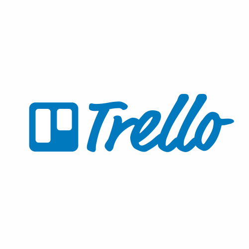

Projeto de desenvolvido em grupo para envolver todas as etapas
de desenvolvimento (desde prototipação quanto desenvolvimento das áreas –
bd/backend/design/frontend).

O desafio foi desenvolver uma lista de desejos, onde deveríamos cadastrar e listar os desejos dos usuários,
usando o banco de dados para salvar as informações,
a api para automatizar os requests e salvar no banco,
o react para interligar a interface com a api e o banco, 
e os layouts para estilizar o processo.

Quadro do Trello

Contribuidores:

Bianca Marangoni 

Ricardo Tamahe 

Thiago Henrique 

